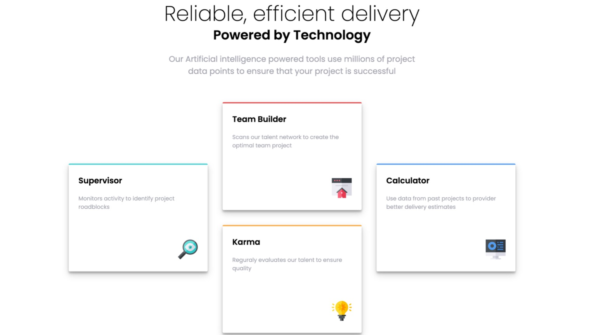

# Frontend Mentor - Four card feature section solution

This is a solution to the [Four card feature section challenge on Frontend Mentor](https://www.frontendmentor.io/challenges/four-card-feature-section-weK1eFYK). Frontend Mentor challenges help you improve your coding skills by building realistic projects.

## Table of contents

- [Overview](#overview)
  - [The challenge](#the-challenge)
  - [Screenshot](#screenshot)
  - [Links](#links)
- [My process](#my-process)
  - [Built with](#built-with)
  - [What I learned](#what-i-learned)
  - [Continued development](#continued-development)
  - [Useful resources](#useful-resources)
- [Author](#author)

## Overview

### The challenge

Users should be able to:

- View the optimal layout for the site depending on their device's screen size

### Screenshot

### Links

- Solution URL: [Add solution URL here](https://your-solution-url.com)
- Live Site URL: [Add live site URL here](https://your-live-site-url.com)

## My process

### Built with

- Semantic HTML5 markup
- CSS custom properties
- CSS Grid
- Mobile-first workflow
- [Gatsby JS](https://www.gatsbyjs.com/) - Gatsby is the fast and flexible framework that makes building websites with any CMS, API, or database fun again.

### What I learned

I learned that Gatsby is an easy framework to use to quickly create prototypes. I like the fact that I can use a tech stack I'm already familiar with like React and Sass. Also, in future projects I can add a CMS of choice and try integrations with Shopify or Auth0, for example.

### Continued development

I think to speed up my prototype setup using Gatsby, I will explore creating a Gatsby theme I can use for future projects. The theme will include commonly used components like Seo, Layout, react hooks, and baseline styles.

### Useful resources

- [Building Gatsby Themes](https://www.gatsbyjs.com/docs/how-to/plugins-and-themes/building-themes/)

## Author

- Website - [Jonri Rothwell](https://www.jonri.codes/)
- Frontend Mentor - [@ygrataydesigns](https://www.frontendmentor.io/profile/grataydesigns)
- Twitter - [@grataydesigns](https://www.twitter.com/grataydesigns)
